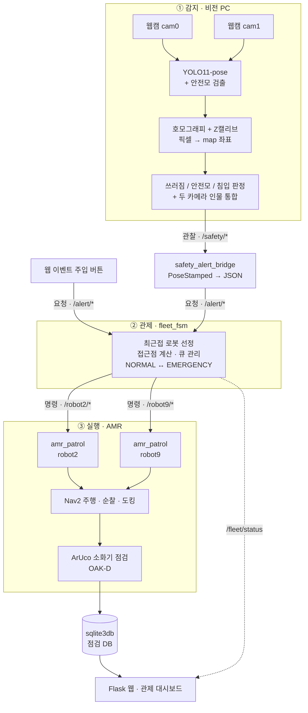
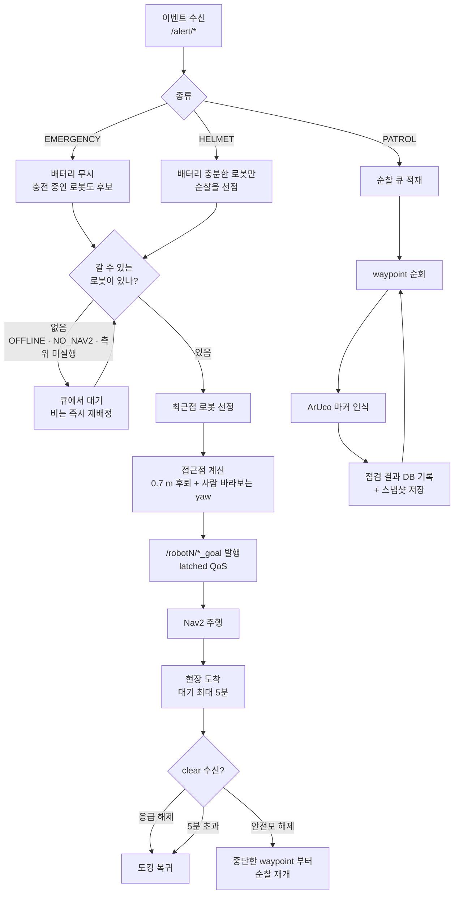

# 산업안전 AMR 관제 시스템

천장 웹캠 2대가 작업자의 **쓰러짐 · 안전모 미착용 · 무단침입**을 감지하면,
관제 FSM이 AMR 2대(`robot2` · `robot9`) 중 **가장 가까운 로봇**을 골라 출동시킨다.
순찰 중에는 소화기의 ArUco 마커를 인식해 점검 결과를 DB에 기록하고 웹으로 조회한다.

---

## 1. 주요 기능

### 1-1. 감지 — 천장 웹캠 2대

| 기능 | 방식 |
|---|---|
| **쓰러짐 감지** | YOLO11-pose 17 keypoints 로 몸통 기울기·높이 판정. bbox 종횡비가 아니라 **머리 높이(Z)** 를 역산해서 판단하므로, 앉거나 웅크린 자세를 쓰러짐으로 오판하지 않는다 |
| **안전모 미착용 감지** | 직접 학습시킨 검출 모델(`best.pt`)로 머리 영역의 안전모 유무 판정 |
| **무단침입 감지** | `entry_roi.json` 의 출입 통제 구역 폴리곤 안에 사람의 **발 위치**가 들어오면 발생 |
| **map 좌표 변환** | 호모그래피(픽셀 → map) + Z캘리브레이션(3×4 projection P)로 SLAM 맵과 같은 좌표계로 변환 |
| **두 카메라 인물 통합** | 카메라 간 겹치는 영역의 동일 인물을 `global_id` 하나로 묶어 중복 출동을 막는다 |
| **상태 디바운스** | 판정이 깜빡일 때 이벤트가 연발되지 않도록 엣지 판정 + CLEAR 디바운스를 건다 |

### 1-2. 관제 — `fleet_fsm` (관제탑)

| 기능 | 방식 |
|---|---|
| **최근접 로봇 선정** | 이벤트 좌표에서 가장 가까운 로봇 배정. 로봇별 거리·배터리·제외 사유를 웹에 그대로 노출 |
| **접근점 계산** | 사람 위치로 그냥 가면 사람을 친다. **0.7 m 물러난 지점 + 사람을 바라보는 yaw** 를 계산해 보낸다 |
| **우선순위 중재** | 응급 > 안전모 > 순찰. 응급은 충전 중인 로봇도 끌어낸다 |
| **큐 관리** | 가용 로봇이 없으면 대기시켰다가 로봇이 비는 즉시 배정 |
| **Nav2 생존 판단** | 노드 그래프에 `planner_server` 가 있는지로 로봇의 주행 가능 여부를 확인해, 못 가는 로봇에 배정하지 않는다 |
| **웹 관제 대시보드** | rosbridge 기반. 지도 위 로봇·사람 실시간 표시, **출동 로봇 선정 근거** 표시, 이벤트 주입 버튼, 토픽 로그 |

### 1-3. 실행 — `amr_patrol` (로봇별)

| 기능 | 방식 |
|---|---|
| **Nav2 주행** | 배정받은 접근점으로 자율 주행 |
| **순찰** | `patrol_points.json` 의 waypoint 순회. 선점당해도 **중단한 waypoint 부터** 재개 |
| **ArUco 소화기 점검** | OAK-D 로 소화기의 ArUco 마커를 읽어 점검 결과 갱신 + 스냅샷 저장 |
| **도킹** | 순찰 완료 또는 배터리 부족 시 복귀. 단 **안전모 배달은 도킹보다 먼저** 처리 |
| **현장 대기 상한** | clear 가 안 와도 5분이면 복귀해 로봇이 묶이지 않게 한다 |
| **철 지난 명령 무시** | payload 의 `timestamp` 로 30초 이상 지난 명령은 버린다 |

### 1-4. 기록 — `sqlite3db`

소화기 점검 결과를 SQLite 에 적재하고 Flask 웹으로 조회한다. 로봇 카메라 프레임과
점검 시점 스냅샷 이미지를 함께 저장한다.

---

## 2. 시스템 설계

### 2-1. 전체 구성 — 관찰 / 요청 / 명령 3계층

토픽을 3계층으로 끊은 것이 이 설계의 핵심이다. **감지는 로봇을 모르고, 로봇은 카메라를
모른다.** 중간의 관제탑만 양쪽을 안다. 덕분에 웹 버튼으로 넣은 가짜 이벤트도 카메라가
넣은 진짜 이벤트와 완전히 동일하게 처리된다 (데모·테스트가 쉬워진다).



| 계층 | 토픽 | 의미 |
|---|---|---|
| **관찰** | `/safety/emergency_state`, `/safety/helmet_state`, `/safety/persons_json` … | 카메라가 본 것. 로봇 개념 없음. 좌표 = **사람의 발 위치** |
| **요청** | `/alert/emergency`, `/alert/helmet`, `/alert/*_clear`, `/alert/patrol`, `/alert/queue_clear` | 관제탑 접수창구. 감지가 넣든 **웹 버튼**이 넣든 동일 처리 |
| **명령** | `/robotN/emergency_goal`, `/robotN/helmet_goal`, `/robotN/patrol_cmd`, `/robotN/*_clear` | 그 로봇에게. 좌표 = 사람에서 **0.7 m 물러난 접근점 + 사람을 바라보는 yaw** |

> 명령 토픽 QoS 는 `RELIABLE` + `TRANSIENT_LOCAL`(latched) 이다. 한 번만 발행해도
> 유실되지 않고 나중에 뜬 로봇에게도 배달된다. 대신 옛 명령이 뒤늦게 배달되는 것을
> 막으려고 payload 의 `timestamp` 로 30초 넘은 명령은 로봇이 버린다.

### 2-2. 이벤트 처리 플로우



### 2-3. 전체 노드 상세 플로우 (Nav2 중심)

노드 · 토픽 · 액션 단위까지 내려간 상세도. 위 요약도와 달리 Nav2 액션 흐름과 각
노드의 내부 분기까지 그렸다.

[](docs/full_system_flow.drawio.svg)

> 4895×5435 크기다. **클릭하면 원본 해상도로 열린다.**

---

## 3. 운영체제 환경

| 항목 | 버전 |
|---|---|
| OS | Ubuntu 22.04.5 LTS (Jammy) |
| ROS 2 | Humble Hawksbill |
| Python | 3.10.12 |
| 빌드 | colcon (ament_python) |
| DDS | Fast DDS — `RMW_IMPLEMENTATION=rmw_fastrtps_cpp` |
| 네트워크 | Discovery Server 모드 · `ROS_DOMAIN_ID=6` |

로봇(TurtleBot4)은 Discovery Server 를 물고 있어서, 접속하는 PC 는 모두
`ROS_DISCOVERY_SERVER` 와 **`ROS_SUPER_CLIENT=True`** 를 지정해야 한다 ([6-1](#6-1-공통-ros-환경-모든-터미널) 참고).

---

## 4. 사용한 장비 목록

| 구분 | 장비 | 용도 |
|---|---|---|
| **AMR** | TurtleBot4 × 2 (`robot2`, `robot9`) | 출동 · 순찰 · 소화기 점검 |
| | └ iRobot Create® 3 | 주행 베이스 · 도킹 · 배터리 |
| | └ OAK-D | ArUco 마커 인식 (`oakd/rgb/image_raw/compressed`) |
| | └ 2D 라이다 | SLAM · Nav2 측위 |
| **천장 카메라** | USB 웹캠 × 2 | cam0 `Web Camera` / cam1 `USB Composite` (Jieli `4c4a:4a55`) |
| **비전 PC** | NVIDIA GPU 탑재 PC | YOLO 추론 전담 + `fleet_fsm` + rosbridge + 웹 |
| **관제 PC** | 일반 PC | DB · 모니터링 웹 (비전 PC 한 대로도 전부 가능) |
| **점검 대상** | 소화기 + ArUco 마커 | 마커 ID 로 개별 소화기 식별 |
| **공유기** | 무선 AP | 로봇·PC 동일 서브넷 |

> 웹캠은 `v4l2-ctl --list-devices` 에 뜨는 **이름으로** 잡는다. USB 를 다시 꽂으면
> `/dev/videoN` 번호가 바뀌기 때문이다. `start.sh` 가 자동으로 찾아준다.

---

## 5. 의존성

### 5-1. Python — [`requirements.txt`](requirements.txt)

```bash
pip3 install -r requirements.txt
```

| 패키지 | 용도 |
|---|---|
| `ultralytics` | YOLO11-pose 자세 추정 + 안전모 검출 (torch 동반 설치) |
| `opencv-python` | 카메라 캡처 · 호모그래피 · 대시보드 렌더링 |
| `numpy` (<2.0) | 좌표 변환 전반. ROS 2 Humble 이 numpy 1.x 라 2.0 은 피한다 |
| `PyYAML` | SLAM 맵 yaml · 파라미터 파싱 |
| `Flask` | 점검 결과 조회 웹 |
| `openpyxl` | 초기 데이터 xlsx 적재 |

### 5-2. ROS 2 — apt

`rclpy`, `cv_bridge` 등은 pip 가 아니라 apt 로 깐다.

```bash
sudo apt install \
    ros-humble-rosbridge-server \
    ros-humble-cv-bridge \
    ros-humble-nav2-simple-commander \
    ros-humble-turtlebot4-navigation \
    ros-humble-irobot-create-msgs \
    ros-humble-tf-transformations
```

또는 워크스페이스 루트에서 `package.xml` 기준으로 한 번에:

```bash
rosdep install --from-paths src --ignore-src -r -y
```

### 5-3. 시스템 유틸

```bash
sudo apt install v4l-utils      # start.sh 의 카메라 자동 탐지 (v4l2-ctl)
```

### 5-4. GPU

YOLO 추론은 CUDA 를 쓴다. NVIDIA 드라이버 + CUDA 지원 PyTorch 가 필요하다.
CPU 로도 돌아가지만 프레임이 감당이 안 되어 감지가 실용적이지 않다.

---

## 6. 실행 순서

### 6-0. 빌드 (최초 1회)

저장소 루트가 곧 colcon 워크스페이스다. 복사 없이 그 자리에서 빌드한다.

```bash
git clone https://github.com/joonwonshin/rokey_turtlebot4_final_project.git
cd rokey_turtlebot4_final_project
pip3 install -r requirements.txt
colcon build && source install/setup.bash
```

### 6-1. 공통 ROS 환경 (모든 터미널)

```bash
source /opt/ros/humble/setup.bash
source ~/rokey_turtlebot4_final_project/install/setup.bash

export RMW_IMPLEMENTATION=rmw_fastrtps_cpp
export ROS_DOMAIN_ID=6
export ROS_DISCOVERY_SERVER=";;<robot2_ip>:11811;;;;;;;<robot9_ip>:11811"
export ROS_SUPER_CLIENT=True
```

> `ROS_DISCOVERY_SERVER` 의 `;` 자리가 곧 서버 인덱스다. 위 예시는 2번=robot2,
> 9번=robot9 이다.
>
> ⚠️ **`ROS_SUPER_CLIENT=True` 는 선택이 아니다.** 일반 client 는 자기가 구독할
> 토픽만 discovery 한다. 그런데 `fleet_fsm` 은 `planner_server` 가 **노드 그래프에
> 존재하는지**로 Nav2 생존을 판단하므로, 이 값이 `False` 면 살아있는 Nav2 를 못 보고
> `NO_NAV2` 로 오판해 **출동을 아예 배정하지 않는다.**

### 6-2. 기동 순서

맵은 감지와 로봇이 **반드시 같은 파일**을 써야 한다. 좌표계가 다르면 로봇이 엉뚱한
곳으로 간다.

| 순서 | 실행 | 위치 |
|---|---|---|
| 1 | `ros2 launch turtlebot4_navigation localization.launch.py namespace:=/robotN map:=<공용 맵>` | AMR PC |
| 2 | `ros2 launch turtlebot4_navigation nav2.launch.py namespace:=/robotN` | AMR PC |
| 3 | `ros2 run fp_amr_fsm amr_patrol_emer_helmet --robot robotN` | AMR PC |
| 4 | `ros2 run amr_aruco aruco_detect` | AMR PC |
| 5 | **`./start.sh`** — rosbridge + fleet_fsm + bridge + 감지 + 웹서버 | 비전 PC |
| 6 | `ros2 launch sqlite3db monitoring.launch.py` | 관제 PC |
| 7 | 웹 접속 `http://<비전PC_IP>:8000/fleet_monitor.html` | 임의 PC |

1~4 는 로봇 2대(`robot2`, `robot9`) 각각에 대해 돌린다.

> ⚠️ **`ros2 launch amr_aruco amr_aruco.launch.py` 는 쓰지 말 것.** 이 launch 는
> `aruco_detect` 뿐 아니라 `amr_aruco` 판 `amr_patrol_emer_helmet` 까지 함께 띄운다.
> 3번에서 `fp_amr_fsm` 판을 이미 띄웠으므로 **한 로봇에 실행부가 2개** 붙어 같은
> goal 을 두고 다투게 된다. ArUco 인식만 필요하므로 4번처럼 `ros2 run` 으로 노드
> 하나만 띄운다. ([9. 알려진 이슈](#9-알려진-이슈) 참고)

### 6-3. 일괄 기동 스크립트 — `start.sh`

비전 PC 쪽 4개 프로세스를 한 방에 띄운다. 스크립트가 놓인 위치를 기준으로 경로를
잡으므로 어느 PC 에 클론해도 그대로 돈다.

```bash
./start.sh          # rosbridge + fleet_fsm + safety_alert_bridge + 웹서버 + 감지
./start.sh --stop   # 전부 종료
```

하는 일:

1. 기존 프로세스 정리 — rosbridge 가 2개 뜨면 하나만 포트 9090 을 잡고 나머지는
   좀비가 된다. 웹이 좀비 쪽에 붙으면 화면이 영원히 `connecting` 이다
2. 카메라 자동 탐지 — `v4l2-ctl` 로 **이름으로** 찾아 `/dev/videoN` 번호 변동을 흡수
3. rosbridge (포트 9090) → 포트가 열릴 때까지 최대 20초 대기
4. `fleet_fsm` · `safety_alert_bridge` 백그라운드 기동 후 생존 확인
5. 웹 대시보드 서빙 (포트 8000)
6. 웹캠 감지를 **포그라운드**로 실행 (모델 로딩 20~30초)

로그는 `.logs/` 에 쌓인다.

> ⚠️ **감지 창은 반드시 `q` 로 종료할 것.** `kill -9` 하면 `cap.release()` 가 안 돌아
> UVC 카메라(cam1)가 먹통이 된다. 복구하려면 `sudo usbreset 4c4a:4a55` 를 해야 한다.
> 그래서 `start.sh --stop` 도 감지에만 `-9` 를 쓰지 않는다.

> 웹은 `file://` 로 직접 열면 안 된다. 그 PC 의 `localhost:9090` 을 보기 때문에 다른
> PC 에서는 못 붙는다. http 로 서빙해야 html 이 **서빙한 호스트**의 9090 을 찾아간다.

### 6-4. 개별 실행

```bash
# 감지만 (상대경로로 모델·캘리브를 참조하므로 반드시 이 폴더 안에서)
cd vision_pc3
python3 12_dual_camera_entry_yolo_tracking_modular.py \
    --cam0-id 4 --cam1-id 0 --publish-ros

# 관제
ros2 run fp_amr_fsm fleet_fsm
ros2 run fp_amr_fsm safety_alert_bridge
ros2 launch rosbridge_server rosbridge_websocket_launch.xml

# DB (최초 1회 생성 후 launch)
ros2 run sqlite3db create_db
ros2 launch sqlite3db monitoring.launch.py
```

---

## 7. 저장소 구조

이 저장소 자체가 colcon 워크스페이스다.

```
rokey_turtlebot4_final_project/
├── README.md
├── requirements.txt
├── start.sh                    # 비전 PC 일괄 기동
├── src/                        # ← colcon 빌드 대상
│   ├── fp_amr_fsm/             #   관제탑 + 실행부 + 관제 웹  ★ 핵심
│   ├── amr_aruco/              #   ArUco 소화기 점검
│   └── sqlite3db/              #   점검 DB + Flask 웹
├── vision_pc3/                 # 웹캠 감지 (단독 Python, ROS 패키지 아님)
│   ├── 12_dual_camera_entry_yolo_tracking_modular.py   # 메인 진입점
│   ├── safety_lib/             #   감지 로직 모듈
│   ├── calibration/            #   실측 캘리브레이션 결과 (필수)
│   ├── yolo11s-pose.pt         #   자세 추정 모델
│   ├── yolo_experiments/best.pt#   안전모 검출 모델 (직접 학습)
│   └── final_project.pgm/.yaml #   SLAM 맵 (좌표계 기준)
├── calibration_tools/          # 캘리브레이션 제작 도구 (셋업 시 1회)
└── docs/                       # 실행 절차서 · 흐름도
```

### 7-1. `vision_pc3/safety_lib/`

| 파일 | 역할 |
|---|---|
| `vision_core.py` | 카메라 루프, YOLO 추론, 좌표 변환 |
| `safety_logic.py` | ★ 쓰러짐/안전모 판정 + 트랙별 상태기계 |
| `base_utils.py` | 호모그래피, Z캘리브(P행렬), 키포인트 유틸 |
| `global_fusion.py` | 두 카메라 간 동일 인물 통합 (`global_id`) |
| `ros_bridge.py` | `/safety/*` 발행 (엣지 판정 + CLEAR 디바운스) |
| `dashboard_ui.py` | OpenCV 대시보드 |
| `state_io.py` | 상태 JSON 저장 |

### 7-2. `calibration_tools/` — 번호가 곧 작업 순서

`vision_pc3/calibration/*.npz` 를 만들어낸 도구들. **카메라를 옮기면 다시 돌려야 한다.**

| 스크립트 | 역할 |
|---|---|
| `00_capture_ref.py` · `01_dual_camera_capture.py` | 기준 프레임 촬영 |
| `02_make_homography_pairwise.py` | 픽셀 ↔ map 대응점 → **호모그래피** `camN_to_map.npz` |
| `03` · `04` | 호모그래피 시각 검증 |
| `05_guided_single_camera_capture.py` | 높이별 대응점 수집 |
| `08_z_height_calibration_test.py` | **3×4 projection P** 산출 → `camN_z_calib.npz` |
| `06` · `07` · `09` ~ `12` | 판정 알고리즘 개발 이력 (bbox → z → pose) |

---

## 8. 우선순위 정책

> **응급(EMERGENCY) > 안전모(HELMET) > AMR 자기 역할(순찰)**

- **응급은 배터리를 보지 않는다.** 충전 중인 로봇도 끌어낸다. 물리적으로 갈 수 없는
  경우(`OFFLINE`, `NO_NAV2`, 측위 미실행)만 제외한다
- **안전모는 순찰을 선점한다.** 배달 후 **도킹하지 않고** 중단된 waypoint 부터 순찰 재개
- 로봇을 명시(`robot_id`)하면 **다른 로봇으로 대체하지 않는다** (응급만 예외)

---

## 9. 알려진 이슈

### `amr_patrol_emer_helmet` 이 두 패키지에 중복 존재한다

| | `fp_amr_fsm` 판 | `amr_aruco` 판 |
|---|---|---|
| 라인 수 | 861 | 354 (모듈 분리) |
| ArUco 소화기 점검 | ❌ | ✅ |
| `helmet_clear` 수신 (안전모 해제) | ✅ | ❌ |
| clear 가 **미실행 goal 취소** | ✅ | ❌ |
| 현장 대기 5분 상한 | ✅ | ❌ |
| 도킹 **전** 안전모 배달 | ✅ | ❌ |
| 응급 시 배터리 무시 | ✅ | ❌ |

**→ FSM 로직은 `fp_amr_fsm` 판이 최신이다. 실행부는 이쪽을 쓴다.**
`amr_aruco` 는 **ArUco 인식 노드**로만 쓴다.

```bash
ros2 run fp_amr_fsm amr_patrol_emer_helmet --robot robot2
ros2 run amr_aruco aruco_detect
```

> 두 판의 통합(= `amr_aruco` 의 모듈 구조 + `fp_amr_fsm` 의 최신 수정)은 남은 과제다.
> 현재는 두 소스를 모두 보존해 이력을 남긴다.

### SLAM 맵이 두 곳에 복제되어 있다

`vision_pc3/final_project.{pgm,yaml}` 와 `src/fp_amr_fsm/maps/final_project.{pgm,yaml}`
는 **같은 파일의 사본**이다 (현재 내용은 일치 — md5 확인).

감지와 로봇이 서로 다른 맵을 쓰면 좌표계가 어긋나 **로봇이 엉뚱한 곳으로 간다.**
지금은 같지만 한쪽만 다시 매핑하면 조용히 갈라진다. 맵을 갱신할 때는 **반드시 양쪽을
같이** 바꾸고 `md5sum` 으로 확인할 것.

```bash
md5sum vision_pc3/final_project.pgm src/fp_amr_fsm/maps/final_project.pgm
```

> 한쪽을 심볼릭 링크로 바꾸거나 단일 위치로 통일하는 것이 근본 해결이다. 남은 과제.

### `amr_aruco` launch 가 실행부를 중복 기동한다

`amr_aruco/launch/amr_aruco.launch.py` 는 `aruco_detect` 와 함께
`amr_aruco` 판 `amr_patrol_emer_helmet` 도 띄우도록 되어 있다. 위 방침대로 실행부를
`fp_amr_fsm` 판으로 쓰는 한 **이 launch 는 쓰면 안 된다.** 통합이 끝나기 전까지는
`ros2 run amr_aruco aruco_detect` 로 인식 노드만 띄운다.

---

## 10. 제외한 것

빌드 산출물(`build/`, `install/`, `log/`, `*.egg-info`), 캐시(`__pycache__`, `*.pyc`),
백업(`*.bak`), 학습 데이터셋, 실험용 모델 가중치, 런타임 산출물(스냅샷 이미지, 로그).

**실행에 필요한 모델 · 캘리브레이션 · 맵은 모두 포함**했다.
